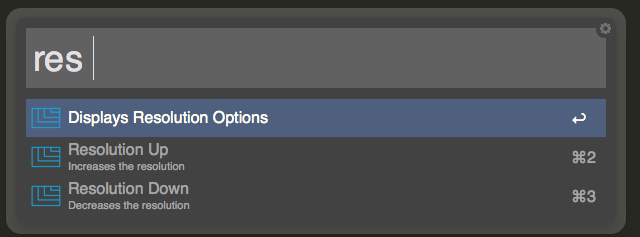
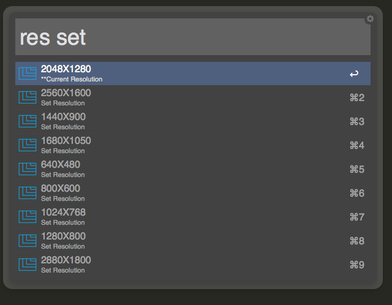

Resolutions-Alfred
==================

Alfred workflow for changing resolutions on primary monitor

------

## Download

[Download workflow](https://github.com/taylorludwig/Resolutions-Alfred/raw/master/Set%20Resolutions.alfredworkflow)

## Features: 

* List available and current resolutions for primary monitor (res set)
* Search and choose a resolution (res set 1200)
* Increase your resolution (res up)
* Decrease your resolution (res down)

## Thanks
[cscreen](http://www.pyehouse.com/cscreen/) by Lynn Pye
